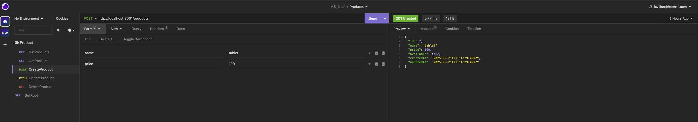

<p align="center">
  <a href="http://nestjs.com/" target="blank"></a>
</p>

[circleci-image]: https://img.shields.io/circleci/build/github/nestjs/nest/master?token=abc123def456
[circleci-url]: https://circleci.com/gh/nestjs/nest

# Tools
<p align="center">
  </a>
   +
  </a>
</p>


# Comandos para crea MS

```bash
nest new products-ms
nest g res products --no-spec
npm i class-validator class-transformer
```

> file `app.module.ts`

```ts
app.useGlobalPipes(
  new ValidationPipe({
    whitelist: true,
    forbidNonWhitelisted: true,
  })
);
```
```bash
npm i dotenv joi

npm i prisma --save-dev
npx prisma init

npx prisma migrate dev --name init

npm i @prisma/client

npm i @nestjs/microservices

```


# Modificacion Variables de entorno

Copiar archivo `.env.template` a `env` asignar valores correspondientes

# Etapa #1 MS Products (REST)

Endpoints:
- GET /products
- GET /products/:id
- POST /products
- PATCH /products/:id
- DELETE /products/:id


----------------------------

----------------------------

----------------------------

----------------------------
